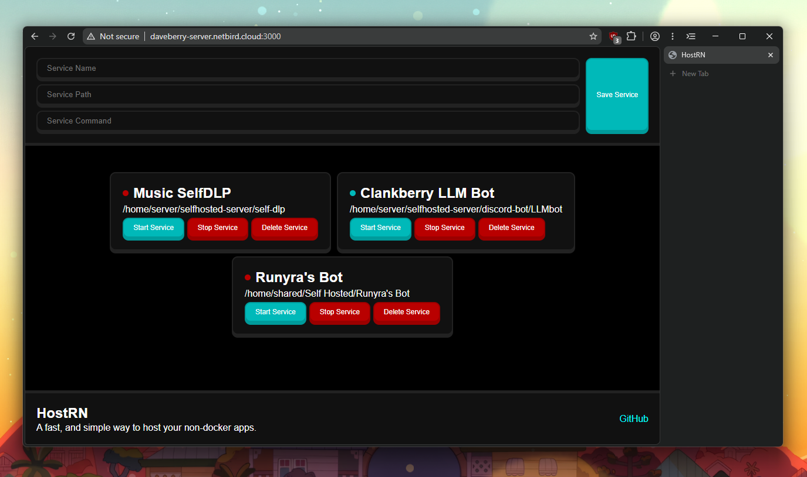

    
    <h1>HostRN</h1>
    

        HostRN is a fun little side project where instead of
        having to manually start and stop services on your terminal,
        you can now do it all from a web interface.
    

    

## FAQ
### Why choose this?
HostRN doesn't use docker. Because... I don't know. Some of my projects that I have in my self-hosted server has some cool stuff I don't want to keep opening my terminal up. So, that's why I made this!

### Isn't there a better alternatives?
Probably. I don't really care that much because this project is mainly for me to learn Rust as the backend and learn SolidJS for the frontend.

### What makes this better?
It's not. Probably. We give you less features because, well, fuck off with a bunch of features. I just want a simple save, start, stop, delete, and list services.

## Tech Stack
- Backend: Rust
    - I wanted a lightweight and stable backend because RAM nowadays is expensive and there's no other DDR4 16gb of ram. Also I just wanted to learn Rust as a excuse.
- Frontend: SolidJS + Express
    - It's a questionable choice why I chose SolidJS and Express. Technically I could've just used SolidJS or Svelte and Vite... But I was against that for some reason. Maybe I'll rework the frontend, who knows.

## Installation
- Ensure you have both `cargo` and `pnpm` installed on your system. You can install cargo from [here](https://www.rust-lang.org/tools/install) and pnpm from [here](https://pnpm.io/installation).
- Clone the repository, and run `pnpm install` to install all the dependencies.
- Once done, run `pnpm run start` to run both servers at once! *The power of workspaces! And also, Rust and SolidJS.*
- Then, just visit `http://localhost:3000` to see the web interface. You can also view it from another device in the same network or zero-trust VPN!
    - PLEASE AND PLEASE create a `.env` file in [@frontend](frontend/) with `PUBLIC_SERVER_IP` set to your server's IP address.

### Updating
In the root folder, just run `git fetch && git pull` to update HostRN. If there was a new dependency added, in the frontend, run `cd frontend && pnpm install` to install it. For the backend, run `cd backend && cargo install` to update it. Then just `cd ..` and `pnpm run start` to restart the app.

## LICENSE
HostRN is licensed under the MIT License. See the [LICENSE](LICENSE) file for more information.
